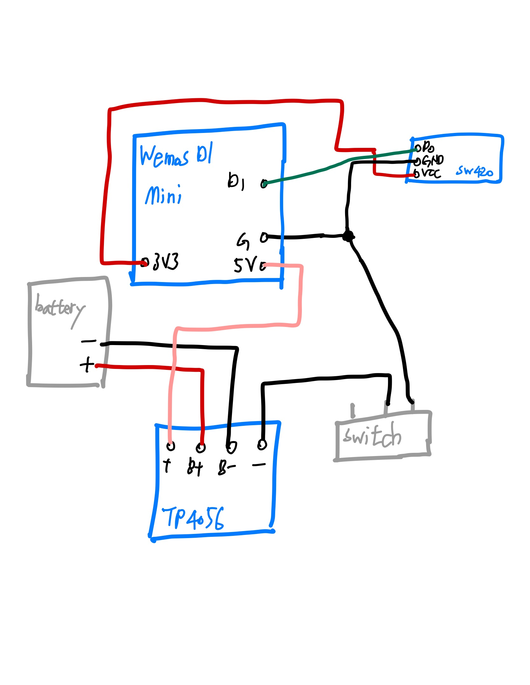

# VRKoeanArchery_Arduino
Capstone Design - Kyung Hee University SWCON

## 국궁 실내 습사 프로젝트

이 아두이노 파일은 유니티와 같이 동작합니다.

참조: https://github.com/FlightFly98/VRKoreanArchery

## 준비물

### 1. 가속도 & 자이로 손목 트래커 2개

 > **센서**
 - Wemos D1 mini 2개
 - mpu6050 (가속도 & 자이로 센서) 2개
 - TP4056 (c-type 충전 포트) 2개
 - 리튬 배터리 523450 2개

 - 회로도<br>


***

### 2. 충격 감지 센서 1개

 > **센서**
 - Wemos D1 mini 1개
 - Sw420 (충격 감지 센서) 1개
 - TP4056 (c-type 충전 포트) 1개
 - 리튬 배터리 523450 1개 
 - 회로도 <br>
 

***

### 3. 낙전 감지 센서 1개 (필수 아님!)
 > **센서**
 - Wemos D1 mini 1개
 - 적외선 트레이서 1개

실제 구동 시 전원만 연결 되어 있으면 됩니다!

## 구동 방법

### 1) 기본 납땜 및 업로드

1. 위 센서들을 전부 납땜합니다.

2. 가속도 & 자이로 센서 1개엔 mpu6050_ZoomHand, 다른 1개엔 mpu6050_KkagjHand를 업로드합니다.

3. 충격 감지 센서에 sw420_EX를 업로드합니다.

4. 낙전 감지 센서에 Nakjeon을 업로드합니다.

### 2) 와이파이 설정 - 아두이노

#### 1. mpu6050_ZoomHand의 전원을 킵니다. <br>
>> const char* ssid = "WemosD1_ZoomHand" => 와이파이 이름<br>
  const char* password = "love00007" => 와이파이 비밀번호<br>

- mpu6050_ZoomHand는 WiFi Ap 역할을 합니다.
- 모든 아두이노가 현재 ap의 이름과 비밀번호로 접속 할 수 있습니다.
- 수정 가능하지만, 모든 아두이노의 접속하려는 ssid와 passward를 수정하여야 합니다.
- 먼저 mpu6050_ZoomHand 전원을 켜야 통신할 와이파이가 생깁니다.

#### 2. 컴퓨터를 mpu6050_ZoomHand의 와이파이에 연결합니다.
- 이 와이파이는 인터넷이 없는 와이파이입니다.
- 어떤 pc는 인터넷이 없는 와이파이는 자동으로 연결 해제하므로 **네트워크 초기화**가 필요할 수 있습니다.

#### 3. 방화벽의 인바운드 규칙을 설정합니다.
- UDP 통신을 위한 포트를 열어줍니다.
- 방화벽 -> 고급 설정 -> 인바운드 규칙 -> 새 규칙
- UDP 및 12346 ~ 12350의 포트를 제한없이 열어둡니다.
- 만약 이 규칙을 적용해도 유니티에서 적용이 안 될 경우, 방화벽을 임시로 해제하고 실행해야 합니다.

#### 4. 다른 모든 아두이노 전원도 킵니다.

#### 5. Server 폴더에서 터미널을 열고 python server.py로 서버를 작동합니다.

 ```python
def get_ip_address():
    result = subprocess.run(["powershell.exe", "-ExecutionPolicy", "Bypass", "-File", "..\\Server\\GetIP.ps1"], capture_output=True, text=True)
    ip_address = result.stdout.strip()
    return ip_address
 ```
 - "..\\Server\\GetIP.ps1" 이 자리에 본인의 GetIP.ps1가 위치한 파일 경로를 넣으셔야 합니다.
 - 모든 아두이노가 연결이 되었는지 확인합니다.
 - "Device at {ip}:{port} is still connected." 또는 "Device at {ip}:{port} reconnected." 메세지가 뜬다면 연결 성공입니다.
 - 12348 포트는 코드에는 있지만 아직 개발중입니다. 연결이 안되는 것이 정상입니다.

#### 6. 모두 연결이 되었다면 아두이노는 준비 완료!
 다시 돌아가기: https://github.com/FlightFly98/VRKoreanArchery